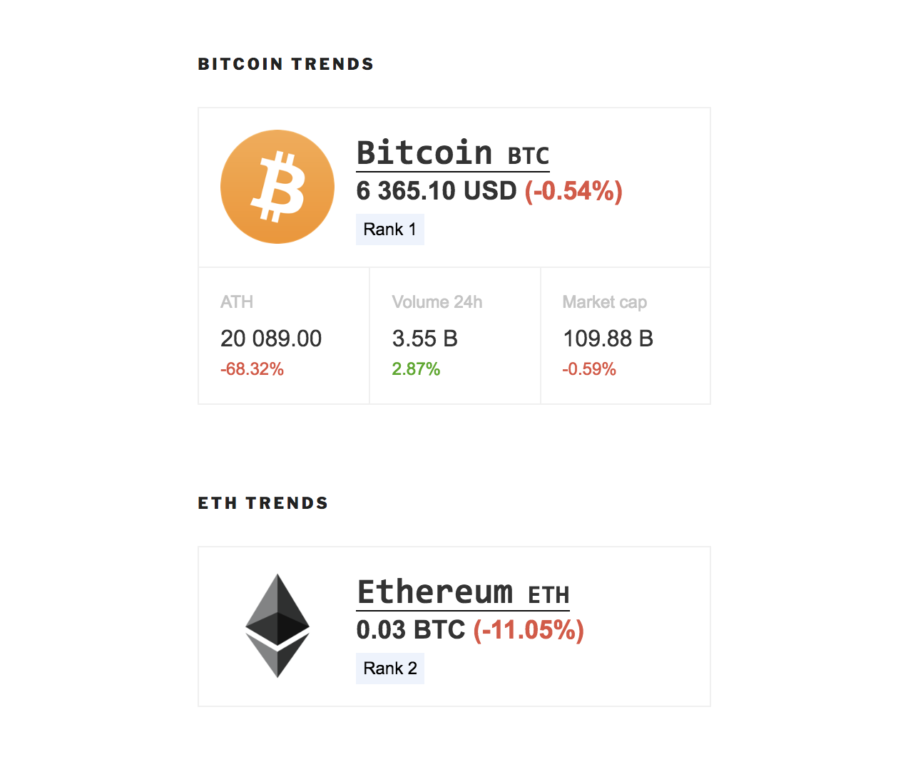

# Coinpaprika Wordpress Plugin

## Features

### Ticker widget

Use this widget to display most important metrics for one selected cryptocurrency. Available in widgets section in Wordpress settings.

### Shortcodes

You can easily put fresh coin metrics in your article with your shortcodes syntax.

#### Coin price in USD:

`[coinpaprika coin="btc-bitcoin"]`

#### Coin price in BTC:

`[coinpaprika coin="eth-ethereum" quote="btc"]`

#### Coin price in ETH:

`[coinpaprika coin="doge-dogecoin" quote="eth"]`

#### ATH (all time high):

`[coinpaprika coin="eth-ethereum" metric="ath"]`

#### Volume 24h:

`[coinpaprika coin="doge-dogecoin" metric="volume24h"]`

#### Market Capitalisation:

`[coinpaprika coin="btc-bitcoin" metric="marketcap"]`

#### Advanced options:

`[coinpaprika coin="doge-dogecoin" quote="eth" metric="volume24h" icon="false" change="false"]`

All options: `[coinpaprika coin="COIN-ID" quote="usd|btc|eth" icon="true|false" metric="price|volume24h|marketcap|ath" change="true|false"]`

What could be used as `COIN-ID`?
* `btc-bitcoin` for Bitcoin
* `eth-ethereum` for Ethereum
* `bch-bitcoin-cash` for Bitcoin Cash
* `eos-eos` for EOS
* `xlm-stellar` for Stellar

etc... for other coins listed on Coinpaprika.

## How to install this plugin on your Wordpress site?

Go to `Plugins` > `Add new` section in Admin Panel and search for `Coinpaprika` or download the installation package from [Plugins Directory](https://wordpress.org/plugins/coinpaprika/).

## Coding standards
[Wordpress PHP Coding Standards](https://make.wordpress.org/core/handbook/best-practices/coding-standards/php)

## Local testing

You can use Docker containers to perform one-click setup of Wordpress installation with our plugin.

To start wordpress run `docker-compose up` in plugin folder and open [localhost:8080](http://localhost:8080/) website.

After the 1st run, you need to activate our plugin on Plugins list.
